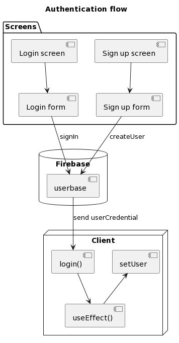

## NativeFireTemplate : Your starter code for any Firebase RN project

### Tech Stack:

- **Framework**: React Native w/ Expo
- **Navigation**: React Navigation

---

## Run the project

```sh
git clone git clone git@github.com:naikibro/NativeFireTemplate.git
```

install the dependencies

```sh
npm i
```

run the application

```sh
npx expo start
```

---

### Features:

1. **Connect to a firebase**: Just copy your firebase config into the [firebase config](./firebase/index.js)
2. **User authentication**: pre-made screens to handle your User authentication ( [login](./screens/LoginScreen.js) | [sign-up](./screens/SignUpScreen.js) )
3. **Navigation**: A react-navigation implementation to simplify your navigation ( [home](./screens/HomeScreen.js) )

---

## Diagrams



---

### About the author

Hi, im Naiki, feel free to use this template and create PRs !
